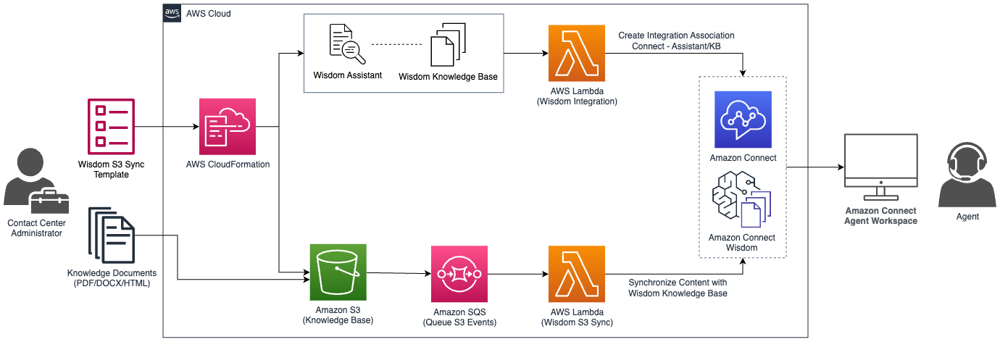

## Amazon Connect Wisdom S3 Sync

**Table of Contents**
- [Amazon Connect Wisdom S3 Sync](#amazon-connect-wisdom-s3-sync)
- [Description](#description)
- [Tenets](#tenets)
- [Features](#features)
- [Project Status](#project-status)
- [Architecture](#architecture)
- [Authors](#authors)
- [Acknowledgement](#acknowledgement)
- [Contributing](#contributing)
- [Security](#security)
- [License](#license)
- [Related Resources](#related-resources)
- [Getting Started](#getting-started)
  - [Prerequisites](#prerequisites)
  - [Key Considerations](#key-considerations)
    - [Existing Resources Policy](#existing-resources-policy)
    - [AWS Resources Created by this Deployment](#aws-resources-created-by-this-deployment)
    - [AWS Resources Deleted by this Deployment](#aws-resources-deleted-by-this-deployment)
  - [AWS CloudFormation Deployment](#aws-cloudformation-deployment)
  - [Uploading Knowledge Content to Amazon S3](#uploading-knowledge-content-to-amazon-s3)

## Description
[Amazon Connect Wisdom](https://aws.amazon.com/connect/wisdom/), a feature of Amazon Connect, delivers agents the information they need, reducing the time spent searching for answers. Amazon Connect Wisdom provides customers with a number of [APIs](https://docs.aws.amazon.com/wisdom/latest/APIReference/Welcome.html) to programmatically configure their knowledge base and perform knowledge management operations at scale. 

**Amazon Connect Wisdom - S3 Sync** enables customers to quickly deploy all of necessary resources to create a Wisdom Knowledge Base using Amazon S3 as its data source. Contact center administrators can easily create, update, and remove knowledge content using familiar Amazon S3 object actions. Using this solution, unstructured knowledge content (TXT/HTML/PDF/DOCX) stored on Amazon S3 are versioned with unique identifiers to ensure content revisions can be rolled back easily using the Amazon S3 Console.

## Tenets
The following tenets guide the development of **Amazon Connect Wisdom S3 Sync**:
- **Accelerate Customer Adoption:** Reduce friction for customers adopting Amazon Connect Wisdom; automating API calls and complex functions, all deployed with a single AWS CloudFormation template.
- **Composable and Reusable:** Ensure the deployment artifacts are composed of unit-tested "building blocks" that can be easily understood and reused by customers.
- **Best Practices:** Leverage software and security best practices throughout the solution, limit external dependencies, handle failure, and ensure least privilege permissions.

## Features
This project features a single CloudFormation template that will deploy Amazon Connect Wisdom configured with a custom knowledge base source (S3). It provisions Amazon Connect Wisdom Resources, an Amazon S3 bucket (versioned), an Amazon SQS queue, AWS Lambda functions automatically. This project will utilize resource tagging for all resources that were created by this deployment to ensure that all resources created by this deployment will be deleted cleanly.

## Project Status
Open Source Release

## Architecture


**Main Template (2023-10-04 Version)** [Amazon Connect Wisdom S3 Sync - Main Template](./amazon-connect-wisdom-s3-sync-template.yml)
- Section 1 (Required): Wisdom Constructs and Integration [1-wisdom-integration](./components/1-wisdom-integration/)
- Section 2 (Required): Wisdom S3 Sync [2-wisdom-s3-sync](./components/2-wisdom-s3-sync/)

**UPCOMING Optional Templates/Components:**
- Wisdom Info
- Wisdom Cleanup
- Wisdom Sample Upload
- Contact Flow - Contact Lens (Realtime) + Amazon Connect Wisdom 

## Authors
[Taylan Unal](https://www.linkedin.com/in/tunal/), Connect Specialist Solutions Architect - Lead Developer/Project Owner 

## Acknowledgement
Naveen Narayan, Principal Connect Specialist Solutions Architect
- Provided reference code and artifacts to manage Amazon Connect Wisdom Integrations.

Angela Yu, Allison Marshall, Girish Mallenahally, and Kevin Neumann 
- Authors of [Ingesting content to power real-time recommendations and search with Amazon Connect Wisdom](https://aws.amazon.com/blogs/contact-center/ingesting-content-to-power-real-time-recommendations-and-search-with-amazon-connect-wisdom/)

## Contributing
Please see [CONTRIBUTING.md](./CONTRIBUTING.md)

## Security
See [CONTRIBUTING](CONTRIBUTING.md#security-issue-notifications) for more information.

## License
This library is licensed under the MIT-0 License. See the LICENSE file.

## Related Resources
- [AWS Blog - Ingesting content to power real-time recommendations and search with Amazon Connect Wisdom](https://aws.amazon.com/blogs/contact-center/ingesting-content-to-power-real-time-recommendations-and-search-with-amazon-connect-wisdom/) - Use the AWS CLI to create Amazon Connect Wisdom Constructs, Integrations, Query an Amazon S3 Knowledge Base
- [Github - Amazon Connect Wisdom API Snippet (NodeJS)](https://github.com/amazon-connect/amazon-connect-snippets/tree/master/projects/WisdomAPI) - Resources to complete the Amazon Connect Wisdom API blog
- [Amazon Connect Wisdom - Region Availability](https://docs.aws.amazon.com/connect/latest/adminguide/regions.html#wisdom_region) - AWS Regions where Amazon Connect Wisdom is available.
- [Amazon Connect Wisdom - Service Quotas](https://docs.aws.amazon.com/connect/latest/adminguide/amazon-connect-service-limits.html#wisdom-quotas) - Service Quotas/Limits for Amazon Connect Wisdom
- [Amazon Connect Wisdom - API Reference](https://docs.aws.amazon.com/wisdom/latest/APIReference/API_Operations.html) - Amazon Connect Wisdom API Documentation

---

## Getting Started
The following instructions will detail deploying the `amazon-connect-wisdom-s3-sync-template.yaml` template on your AWS Account.
- For in-depth guidance, please visit:
  - [Amazon Connect Wisdom Workshop - Module 2.1](https://catalog.workshops.aws/amazon-connect-wisdom/en-US/2-ingestcontent/21-ingestfroms3)
  - [Introduction to Amazon Connect - Module 3 - Set up Wisdom](https://catalog.workshops.aws/amazon-connect-introduction/en-US/module3/wisdom/set-up-wisdom)
  - [Agent Empowerment Suite on Amazon Connect - Enabling Wisdom](https://catalog.us-east-1.prod.workshops.aws/workshops/15785008-e77e-4da9-b7dd-9313244fca94/en-US/wisdom/set-up-wisdom)

### Prerequisites
- An AWS Account
- An AWS User with [AdministratorAccess](https://docs.aws.amazon.com/aws-managed-policy/latest/reference/AdministratorAccess.html) IAM Policy
- An existing Amazon Connect Instance deployed in any AWS Region where Amazon Connect Wisdom is [supported](https://docs.aws.amazon.com/connect/latest/adminguide/regions.html#wisdom_region). 
- Familiarity with the AWS Management Console, AWS CloudFormation, and Amazon Connect

### Key Considerations
#### Existing Resources Policy
This Deployment **WILL NOT:**
1. Delete any existing Amazon Connect Wisdom Resources (Wisdom Assistants, Knowledge Base, Assistant Associations) that were not created by this template.
2. Delete the Amazon S3 Bucket created by this deployment, or any of the files uploaded to it.

#### AWS Resources Created by this Deployment
- **[Amazon Connect Wisdom](https://aws.amazon.com/connect/wisdom/)** - Wisdom Assistant, Wisdom Knowledge Base, Assistant Association (Assistant-Knowledge Base)
  - Verify that you are not exceeding any of your Amazon Connect Wisdom [Service Quotas](https://docs.aws.amazon.com/connect/latest/adminguide/amazon-connect-service-limits.html#wisdom-quotas)
- **[Amazon Connect](https://aws.amazon.com/connect/)** - Amazon Connect Integration Association (WISDOM_ASSISTANT and WISDOM_KNOWLEDGE_BASE)
  - [Integration Associations](https://docs.aws.amazon.com/connect/latest/APIReference/API_CreateIntegrationAssociation.html)
* **[Amazon S3](https://aws.amazon.com/s3/)** - An Amazon S3 Bucket to store and manage knowledge base content.
* **[Amazon SQS](https://aws.amazon.com/sqs/)** - An Amazon SQS Queue to queue Amazon S3 Object events, preventing API Throttling.
- **[AWS Lambda](https://aws.amazon.com/lambda/)** - AWS Lambda functions that will (1)Integrate Wisdom Constructs with Amazon Connect and (2) Handle the synchronization of  knowledge base content between Amazon S3 and Amazon Connect Wisdom.

#### AWS Resources Deleted by this Deployment
- **ONLY** those Wisdom Resources - Wisdom Assistant, Knowledge Base, and Assistant Association that were initially created by this deployment will be removed when the stack is deleted.
- **ONLY** Amazon Connect Integration Associations (WISDOM_ASSISTANT, WISDOM_KNOWLEDGE_BASE) created by this deployment will be removed when the stack is deleted.

### AWS CloudFormation Deployment
In this section, we will deploy an AWS CloudFormation template that will create Amazon Connect Wisdom constructs, integrate those Wisdom resources with an Amazon Connect Instance, and deploy the required artifacts to use Amazon S3 as a knowledge base for Amazon Connect Wisdom.

**Step 1: Download the `Amazon Connect Wisdom S3 Sync` CloudFormation Template**
Navigate to the `amazon-connect-wisdom-s3-sync` repository root directory.
Open the `amazon-connect-wisdom-s3-sync-template.yml` file and [download](https://docs.github.com/en/repositories/working-with-files/using-files/viewing-a-file#viewing-or-copying-the-raw-file-content) the file to your local machine.
  
**Step 2: Navigate to AWS CloudFormation**
Navigate to AWS CloudFormation on your AWS Management Console (Ex. https://us-east-1.console.aws.amazon.com/cloudformation/)

**Step 3: Create a CloudFormation Stack** 
1. On the AWS CloudFormation Landing page, select `Create Stack`
2. **Prerequisite - Prepare template** - In this section, choose `Template is ready` 
3. **Specify template** - choose `Upload a template file` and select the `Choose file` button to upload a CloudFormation template from your local machine.
   1. Upload the template for this deployment that you've downloaded, or download the CloudFormation template now [here](../amazon-connect-wisdom-s3-sync-template.yml)
4. To accept your settings, choose `Next` to proceed to the `Specify stack details` page.
  
**Step 4: Specify Stack Details**
In this section, we'll specify the After selecting a stack template, specify the stack name and values for the parameters that were defined in the deployment template.

1. `Stack Name`: Choose a stack name like: `wisdom-s3-sync` or `amazon-connect-bootcamp-wisdom`
   1. The stack name is an identifier that helps you find a particular stack from a list of stacks. A stack name can contain only alphanumeric characters (case-sensitive) and hyphens. It must start with an alphabetic character and can't be longer than 128 characters.
2. `AmazonConnectInstanceARN`: Enter your **Amazon Connect Instance ARN** - [Find your Amazon Connect instance ID/ARN](https://docs.aws.amazon.com/connect/latest/adminguide/find-instance-arn.html)
   1. For the best results, specify an Amazon Connect Instance without an existing Wisdom Deployment
3. `WisdomS3BucketName`: Provide a globally unique name for a new Amazon S3 Bucket, which will be used to store knowledge content
   1. Do **not** enter an existing S3 bucket. This process will create a new one in the account, and will require you to retry the process if a S3 bucket with this name already exists. 
   2. We recommend making this value unique, such as `firstname-date-wisdom-s3-bucket` as long as the name is less than 63 characters and all lowercase. You can find all the S3 bucket naming rules [here.](https://docs.aws.amazon.com/AmazonS3/latest/userguide/bucketnamingrules.html)

After configuring your Stack name and parameters, click the `Next` button to continue. 

**Step 5: Configure stack options**
Leave all options on the `Step 3 - Configure stack options` page as defaults, scroll to the bottom of the page, and click the `Next` button to continue.

**Step 6: Review**
The final step before your stack is launched is to review the values entered while creating the stack. On the Review page, review the details of your stack.

1. If you need to change any of the values before launching the stack, choose Edit on the appropriate section to go back to the page that has the setting that you want to change.
2. After you review the stack creation settings, choose `Create stack` to launch your stack.

```
NOTE: This AWS CloudFormation deployment should take less than 5 minutes to complete.
```
3. Once the stack was successfully deployed, you will see the stack status change to **CREATE_COMPLETE**.

---

### Uploading Knowledge Content to Amazon S3
After the stack has deployed successfully, we will upload  that was created as a part of this deployment.

After the AWS CloudFormation Stack from the previous section has successfully deployed, you can manage knowledge content by (Creating, Updating, Deleting) Knowledge content files (HTML/PDF/DOCX) files on the S3 Bucket created by the deployment.

1.  Sign in to the AWS Management Console and open the Amazon S3 console at https://console.aws.amazon.com/s3/
2.  From the list of Amazon S3 Buckets, you should see new Amazon S3 bucket created by the CloudFormation template. Select the bucket name to open it.
3. Download the following sample file:[password-reset.html](./sample/password-reset.html) to upload into your Amazon S3 bucket. . This HTML file is from the Amazon Connect Admin Guide (https://docs.aws.amazon.com/connect/latest/adminguide/password-reset.html), and provides guidance on how to reset an Amazon Connect user's password.

4. Drag and drop the `password-reset.html` file into your Amazon S3 bucket. Select **Upload** at the bottom of the screen. 

5. You will see a green banner showing **Upload succeeded**. Select close.

6. Once complete, you can access this document within your Amazon Connect Agent Workspace by [Search for content using Amazon Connect Wisdom](https://docs.aws.amazon.com/connect/latest/adminguide/search-for-answers.html) using phrases like "password" or "reset my password".

You have successfully deployed Amazon Connect Wisdom on your Amazon Connect instance and uploaded knowledge content to your Amazon S3 Knowledge Base!
